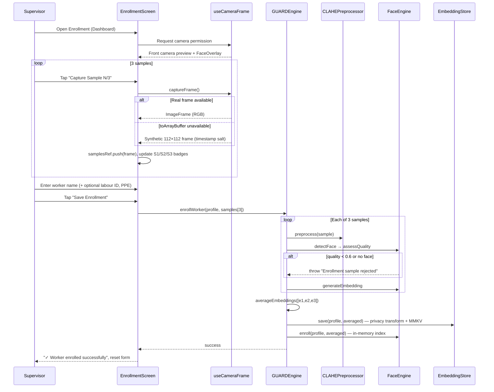

# GUARD — Project Documentation & Implementation Plan

**Geo-locked Unified Attendance & Recognition for Datalake**

| Field | Value |
|-------|-------|
| Version | 0.1.0 (`package.json`) |
| Package name | `guard-datalake-module` |
| Platform | React Native 0.74 (Android + iOS) |
| Target integration | Datalake 3.0 (NHAI Hackathon 7.0) |
| Repository | `https://github.com/ctrl-shit-del/nhai.git` |
| Native app ID | `com.guard.datalake` |

---

## Table of Contents

1. [Executive Summary](#1-executive-summary)
2. [Problem & Business Context](#2-problem--business-context)
3. [Solution Overview](#3-solution-overview)
4. [Technology Stack](#4-technology-stack)
5. [System Architecture](#5-system-architecture)
6. [End-to-End Data Flow](#6-end-to-end-data-flow)
7. [Project Structure](#7-project-structure)
8. [Core Modules (Implementation Detail)](#8-core-modules-implementation-detail)
9. [Data Contracts & Types](#9-data-contracts--types)
10. [**Enrollment System — Deep Dive**](#10-enrollment-system--deep-dive) ⭐
11. [Other User Flows & Screens](#11-other-user-flows--screens)
12. [Security, Privacy & Cryptography](#12-security-privacy--cryptography)
13. [Machine Learning Pipeline](#13-machine-learning-pipeline)
14. [Configuration & Thresholds](#14-configuration--thresholds)
15. [Datalake 3.0 Integration](#15-datalake-30-integration)
16. [AWS Sync API Contract](#16-aws-sync-api-contract)
17. [Implementation Status Matrix](#17-implementation-status-matrix)
18. [Production Implementation Plan](#18-production-implementation-plan)
19. [Build, Run & Demo](#19-build-run--demo)
20. [Non-Functional Requirements](#20-non-functional-requirements)
21. [Risks & Mitigations](#21-risks--mitigations)
22. [Glossary](#22-glossary)
23. [Related Documents](#23-related-documents)

---

## 1. Executive Summary

**GUARD** is an offline-first React Native module that authenticates NHAI and EPC construction-site laborers using on-device facial recognition, dual-layer liveness detection, GPS geofencing, and a **SHA-256 Merkle chain** audit log. It is designed to plug into the existing **Datalake 3.0** supervisor app—not replace it.

**Core value:** Reduce attendance fraud (ghost workers, proxy marking, deletable logs) at sites with **zero or intermittent connectivity**, while producing records suitable for **DBT payroll** and **CAG/internal audits**.

**How it works in one sentence:** A supervisor enrolls workers with three face samples; at attendance time the device runs detect → preprocess → liveness → embed → match → chain append entirely offline; when network returns, signed batches sync to AWS and local records purge only after server ACK.

**Enrollment (expanded):** [Section 10](#10-enrollment-system--deep-dive) — UI capture flow, `enrollWorker()` pipeline, dual storage, PRD EN-* mapping, and production gaps.

---

## 2. Problem & Business Context

### 2.1 Field scenario

| Factor | Typical reality |
|--------|-----------------|
| Workers per site | 200–500 |
| Network | BSNL 2G at best; often none for days |
| Environment | Harsh sun, dust, helmets/PPE, pre-dawn shifts |
| Who marks attendance | Site supervisor (foreman / junior engineer) |
| Payroll link | DBT to Jan Dhan accounts |
| Audit need | Tamper-proof chain-of-custody |

### 2.2 Why existing solutions fail

| Approach | Failure mode |
|----------|--------------|
| Thumb biometrics | Needs power, network, separate hardware |
| OTP / cards | Easily proxied; no liveness |
| Cloud face recognition | Requires live internet |
| Simple offline apps | Flat SQLite; deletable; weak audit |
| Manual muster | High fraud; not DBT-compatible |

### 2.3 Financial impact (conservative)

- Single 500-worker site, 300 days/year, ₹600/day, 10% ghost fraud → **~₹90 lakh/site/year**
- ~1,200 NHAI active sites → aggregate leakage on the order of **₹1,000+ crore/year** (PRD estimate)

### 2.4 Personas

| Persona | Role | GUARD interaction |
|---------|------|-------------------|
| Site supervisor | Primary operator | Enroll, mark attendance, sync |
| Field worker | Passive subject | Follow blink/smile prompts at camera |
| Site/regional manager | Reviewer | Views synced data in Datalake dashboard |
| CAG / auditor | Compliance | Verifies chain integrity on exported batches |

---

## 3. Solution Overview

### 3.1 Goals (in scope)

| ID | Goal |
|----|------|
| G1 | >95% offline recognition on 3 GB RAM, Android 8+ / iOS 12+ |
| G2 | Dual-layer liveness (active challenges + passive anti-spoof) |
| G3 | Tamper-evident Merkle chain audit trail |
| G4 | 200–500 workers per device; sub-second recognition |
| G5 | Signed sync to Datalake/AWS; purge only after ACK |
| G6 | Drop-in Datalake 3.0 module (minimal surface area) |
| G7 | Model footprint under cap; pipeline under 1 s |

### 3.2 Non-goals

- Does **not** replace Datalake 3.0
- Does **not** run payroll calculations
- Does **not** require new hardware (supervisor phone only)
- Does **not** depend on paid/proprietary ML libraries

### 3.3 Key differentiators

1. **SHA-256 Merkle chain** — any delete/insert/modify breaks verification
2. **Dual-layer liveness** — randomized active challenges + passive MiniFAS/heuristic
3. **CLAHE preprocessing** — outdoor lighting normalization before inference
4. **Signed commit sync** — HMAC batches; local purge gated on server ACK
5. **Privacy-transformed embeddings** — hardware-backed key; no raw vectors on chain or wire

---

## 4. Technology Stack

| Layer | Technology | Purpose |
|-------|------------|---------|
| UI framework | React 18 + React Native 0.74 | Cross-platform app shell |
| Navigation | `@react-navigation/native-stack` | Dashboard, Attendance, Enrollment, Chain Audit, Sync |
| Camera | `react-native-vision-camera` 4.x | Live preview; frame capture hook |
| ML inference | `react-native-fast-tflite` 1.4 | BlazeFace, MobileFaceNet, MiniFAS |
| Worklets | `react-native-worklets-core` + Reanimated 3.10 | Frame processor (currently no-op for ANR safety) |
| Crypto | `crypto-js` | SHA-256, HMAC-SHA256 (`hash.ts`) |
| Fast storage | `react-native-mmkv` | Encrypted embeddings + chain persistence |
| Secrets | `react-native-keychain` | Android Keystore / iOS Secure Enclave key |
| Location | `@react-native-community/geolocation` | GPS at commit time |
| Network | `@react-native-community/netinfo` | Auto-sync on reconnect |
| Device ID | `react-native-device-info` | Stable `deviceId` |
| Language | TypeScript 5.4 | Typed contracts in `src/types` |

---

## 5. System Architecture

### 5.1 Logical layers

```
┌─────────────────────────────────────────────────────────────┐
│  App.tsx — config, navigation, auto-sync, sendBatch()     │
├─────────────────────────────────────────────────────────────┤
│  Screens — Enrollment, Attendance, ChainAudit, Sync, Dash  │
├─────────────────────────────────────────────────────────────┤
│  GUARDEngine (facade) — single integration API             │
│    ├─ CLAHEPreprocessor                                      │
│    ├─ FaceEngine (detect, embed, match)                    │
│    ├─ LivenessDetector                                       │
│    ├─ EmbeddingStore (MMKV + keychain)                     │
│    ├─ MerkleChain                                            │
│    └─ SyncEngine                                             │
├─────────────────────────────────────────────────────────────┤
│  GuardStorage + MmkvKeyValueStorage — chain persistence      │
└─────────────────────────────────────────────────────────────┘
                          │ (when online)
                          ▼
              POST /v1/attendance/sync (Datalake 3.0)
```

### 5.2 `GUARDEngine` — central facade

**File:** `src/config/GUARDEngine.ts`

**Construction:**

```typescript
const engine = new GUARDEngine(config, storage);
await engine.initialize();
```

**Responsibilities:**

| Method / area | Behavior |
|---------------|----------|
| `initialize()` | Hydrate Merkle chain from storage; init FaceEngine + EmbeddingStore; load 3 TFLite models (graceful fallback) |
| `beginEnrollmentSession()` | Create supervisor liveness session (optional gate) |
| `enrollWorker()` | 3 samples → CLAHE → detect → quality → embed → average → EmbeddingStore + FaceEngine.enroll |
| `markAttendance()` | Geofence → CLAHE → detect → liveness → embed → match → Merkle append → persist |
| `getStats()` | Chain length, enrolled count, unsynced, integrity, model load flags |
| `syncPending(sendBatch)` | Chunked signed batches via SyncEngine |

**Public export surface for Datalake:** `src/GUARD.ts` re-exports `GUARDEngine`, constants, storage helpers, and all types.

### 5.3 Application bootstrap (`App.tsx`)

1. Resolve `deviceId` via `getGuardDeviceInfo()`
2. Build `GUARDConfig` (demo: `NHAI-DEMO-SITE`, mock token, optional `syncEndpoint`)
3. Create `GuardStorage` over `MmkvKeyValueStorage` keyed by `siteId` + `deviceId`
4. `useGUARDEngine(config, storage)` → initialize engine
5. `useNetworkMonitor()` → on reconnect, `engine.syncPending(sendBatch)`
6. `createSendBatch(config)` → real `fetch` POST or mock ACK if no endpoint

---

## 6. End-to-End Data Flow

### 6.1 Enrollment pipeline (summary)

Enrollment is the **identity registration** step: the supervisor captures three face samples per worker, the engine validates quality and builds one averaged embedding, then persists it for offline recognition at attendance time.

```
Supervisor → EnrollmentScreen → 3× captureFrame() → enrollWorker()
    → per sample: CLAHE → detect → quality ≥ 0.6 → embed
    → average(3 embeddings) → EmbeddingStore (MMKV) + FaceEngine (RAM)
```

**Full operational detail:** see [Section 10 — Enrollment System — Deep Dive](#10-enrollment-system--deep-dive).

### 6.2 Attendance pipeline

```
Supervisor opens AttendanceScreen
    → GPS watchPosition (continuous)
    → User completes active liveness (BLINK, SMILE, etc.)
    → captureFrame() + activeLivenessSession
    → GUARDEngine.markAttendance(frame, gps, session)
        1. Geofence check (if config.siteLocation set)
        2. Downscale frame to max 320px (performance)
        3. CLAHE preprocess
        4. BlazeFace detect + quality gate
        5. Passive liveness (MiniFAS TFLite OR heuristic OR skip on flat mock frame)
        6. MobileFaceNet embedding
        7. Cosine match vs enrolled workers
        8. LOW tier → REVIEW_REQUIRED unless allowLowConfidenceCommit
        9. MerkleChain.appendAttendance()
        10. GuardStorage.saveChain()
```

### 6.3 Sync pipeline

```
Network restored OR manual Sync screen
    → SyncEngine.createBatches()  [50 records/chunk, integrity pre-check]
    → For each batch:
        HMAC-SHA256 device signature
        POST to syncEndpoint (or mock ACK)
        verifyAck(batch, ack)
        markSynced(recordIds)
    → purgeSynced(records older than 24h post-ACK)
    → persist chain snapshot
```

### 6.4 Merkle chain rule

For each record (attendance or spoof incident):

```
previousHash = tail of chain (or site+device genesis hash)
chainHash    = SHA256(stableStringify(unsignedRecord))
```

Genesis hash:

```typescript
SHA256({ type: 'GUARD_GENESIS', siteId, deviceId, empty: EMPTY_CHAIN_HASH })
```

Attendance and spoof incidents share one ordered chain (`chainIndex`).

---

## 7. Project Structure

```
nhai/
├── App.tsx                          # Root: config, nav, auto-sync
├── index.js                         # RN entry
├── app.json                         # displayName: GUARD
├── package.json
├── android/                         # com.guard.datalake
│   └── app/src/main/assets/models/  # TFLite binaries (bundled)
├── ios/                             # Xcode project
├── models/                          # Placeholders / README (gitignored binaries)
├── docs/
│   ├── PROJECT_DOCUMENTATION.md     # This file
│   ├── PRD.md
│   ├── INTEGRATION_GUIDE.md
│   └── BENCHMARKS.md
├── PRD.md                           # Full product requirements (14 sections)
├── README.md
└── src/
    ├── GUARD.ts                     # Public module exports
    ├── config/
    │   ├── GUARDEngine.ts           # Facade
    │   └── constants.ts             # Thresholds, model paths
    ├── screens/
    │   ├── DashboardScreen.tsx
    │   ├── EnrollmentScreen.tsx
    │   ├── AttendanceScreen.tsx
    │   ├── ChainAuditScreen.tsx
    │   └── SyncScreen.tsx
    ├── hooks/
    │   ├── useGUARDEngine.ts
    │   ├── useCameraFrame.ts
    │   └── useNetworkMonitor.ts
    ├── ml/
    │   ├── FaceEngine.ts
    │   ├── CLAHEPreprocessor.ts
    │   └── LivenessDetector.ts
    ├── security/
    │   ├── MerkleChain.ts
    │   └── EmbeddingStore.ts
    ├── sync/
    │   └── SyncEngine.ts
    ├── storage/
    │   ├── GuardStorage.ts
    │   └── MmkvKeyValueStorage.ts
    ├── utils/
    │   ├── hash.ts
    │   ├── GPSHelper.ts
    │   ├── DeviceInfo.ts
    │   └── imageUtils.ts
    ├── components/
    │   ├── FaceOverlay.tsx
    │   ├── WorkerCard.tsx
    │   ├── ChainBadge.tsx
    │   └── SyncProgressBar.tsx
    └── types/
        └── index.ts
```

---

## 8. Core Modules (Implementation Detail)

### 8.1 `CLAHEPreprocessor` (`src/ml/CLAHEPreprocessor.ts`)

- **Input:** `ImageFrame` — `{ width, height, channels, data: Uint8Array }`
- **Output:** Preprocessed frame for detection/embedding
- **Purpose:** Normalize local contrast for harsh outdoor lighting (~8% accuracy gain vs raw, per README)
- **Status:** Fully implemented in TypeScript (tile-based histogram clip/redistribute)

### 8.2 `FaceEngine` (`src/ml/FaceEngine.ts`)

| Stage | Production path | Demo fallback |
|-------|-----------------|---------------|
| `detectFace` | BlazeFace 128×128, conf ≥ 0.5 | Fixed 60%×65% mock box, conf 0.92 |
| `assessQuality` | confidence × area composite ≥ 0.6 | Same |
| `generateEmbedding` | MobileFaceNet 112×112, L2 normalize | SHA-256 seed → 128-dim vector |
| `match` | Cosine similarity vs enrolled; tiers HIGH/MEDIUM/LOW | Same |

Embeddings in memory for matching are L2-normalized; chain stores **hash only** (`embeddingHash`).

### 8.3 `LivenessDetector` (`src/ml/LivenessDetector.ts`)

**Active:**

- Pool: `BLINK`, `SMILE`, `HEAD_LEFT`, `HEAD_RIGHT`
- Session picks **2 challenges** deterministically from SHA-256(seed)
- Timeout: 15 s (`livenessTimeoutMs`)
- `evaluateActive(session, completed)` — all challenges must be completed

**Passive:**

- **Production:** MiniFAS 80×80 via `GUARDEngine.evaluatePassiveLiveness` → `evaluatePassiveFromScore`
- **Fallback:** Luminance + local variance + RGB channel spread heuristic
- Threshold: `spoofScore ≤ 0.35` (`passiveSpoof`)

**Failure:** `appendSpoofIncident` on chain; outcome `REVIEW_REQUIRED` with `LIVENESS_FAILED` or `LIVENESS_TIMEOUT`

### 8.4 `EmbeddingStore` (`src/security/EmbeddingStore.ts`)

- Keychain service `guard_embedding_key` — 256-bit random on first launch
- MMKV `guard_embeddings_v2` encrypted with key slice
- `privacyTransform`: additive perturbation from SHA-256(deviceSecret); vectors not reversible without secret
- CRUD: `save`, `get`, `list`, `delete` per `workerId`

### 8.5 `MerkleChain` (`src/security/MerkleChain.ts`)

- `appendAttendance`, `appendSpoofIncident`
- `verifyIntegrity()` → `ChainIntegrityReport` (`PREVIOUS_HASH_MISMATCH`, `CHAIN_HASH_MISMATCH`)
- `getUnsyncedAttendance()`, `markSynced`, `purgeSynced`
- `hydrate()` on app start from `GuardStorage`

### 8.6 `SyncEngine` (`src/sync/SyncEngine.ts`)

- Refuses sync if `verifyIntegrity().valid === false`
- Chunks of **50** records (`syncChunkSize`)
- Batch fields: `batchId`, `checksum`, `chainTailHash`, `deviceSignature`, `integrityReport`, `records`
- ACK validation: status, batchId, recordCount, `serverAck` present

### 8.7 `GuardStorage` + `MmkvKeyValueStorage`

- Key: `guard:{siteId}:{deviceId}:chain`
- JSON snapshot: `{ attendanceRecords, spoofIncidents }`
- App uses MMKV-backed storage (not in-memory) in `App.tsx` for production-like persistence

### 8.8 `useCameraFrame` (`src/hooks/useCameraFrame.ts`)

- **Design note:** Frame processor is **intentionally no-op** to avoid ANR from passing VisionCamera `Frame` directly to TFLite (`no ArrayBuffer attached`)
- Camera **preview works**; `captureFrame()` supplies synthetic/mock frames for demo pipeline
- **Production task:** `frame.toArrayBuffer()` → RGB → `ImageFrame` → existing `FaceEngine` path

### 8.9 Utilities

| File | Role |
|------|------|
| `hash.ts` | `stableStringify`, `sha256Placeholder`, `hmacPlaceholder` (real CryptoJS) |
| `GPSHelper.ts` | Haversine geofence; default radius 500 m |
| `DeviceInfo.ts` | Unique device ID for config |
| `imageUtils.ts` | `cropAndNormalize`, `fullFrameNormalize` for TFLite tensors |

---

## 9. Data Contracts & Types

**Source:** `src/types/index.ts`

### 9.1 `GUARDConfig`

| Field | Type | Description |
|-------|------|-------------|
| `siteId` | string | Active construction site |
| `deviceId` | string | Hardware-unique supervisor device |
| `datalakeAuthToken` | string | Bearer token for sync API |
| `syncEndpoint` | string? | If omitted → mock ACK (dev) |
| `recognitionThreshold` | number? | Default 0.72 |
| `requireSupervisorLivenessForEnrollment` | boolean? | Gate enrollment session |
| `allowLowConfidenceCommit` | boolean? | Allow LOW tier commits |
| `siteLocation` | `{ lat, lng, radiusM? }`? | Geofence enforcement |

### 9.2 `AttendanceRecord` (chain block payload)

Includes: `recordId`, `workerId`, `workerName`, `siteId`, `embeddingHash`, `livenessSessionId`, `recognitionConfidence`, `confidenceTier`, `reviewRequired`, `timestamp`, GPS fields, `chainIndex`, `previousHash`, `chainHash`, `deviceId`, optional `syncedAt`.

**Never stored on chain:** raw embedding or face image.

### 9.3 `SyncBatch` / `SyncAck`

- Batch signed with HMAC over `{ batchId, checksum, chainTailHash, recordCount }`
- ACK must match `batchId` and `recordCount` before purge

### 9.4 `AttendanceOutcome`

- `COMMITTED` | `REVIEW_REQUIRED`
- Reasons: `OUTSIDE_GEOFENCE`, `LIVENESS_FAILED`, `LIVENESS_TIMEOUT`, `LOW_CONFIDENCE_MATCH`

---

## 10. Enrollment System — Deep Dive

Enrollment is how GUARD **learns who each worker is** on a supervisor device. Unlike attendance (daily, liveness-gated, Merkle-logged), enrollment is a **one-time (or rare re-enrollment) setup** performed when a worker joins the site. No network is required. No attendance record is written to the Merkle chain during enrollment—only the **local biometric template** (privacy-transformed embedding) is created.

### 10.1 Role in the overall system

| Aspect | Enrollment | Attendance (for contrast) |
|--------|------------|---------------------------|
| Actor | Site supervisor | Site supervisor |
| Subject | New worker’s face | Enrolled worker’s face |
| Samples | **3** face captures, averaged | **1** capture after liveness |
| Liveness | Optional supervisor gate (`EN-01`) | Required (active + passive) |
| GPS / geofence | Not used | Used if `siteLocation` set |
| Merkle chain | **Not written** | `appendAttendance()` |
| Persistence | `EmbeddingStore` + `FaceEngine` | Chain + match only |
| Output | `workerId` + template for cosine match | `AttendanceRecord` |

After enrollment succeeds, `FaceEngine.match()` can recognize that worker on the **same app session**. Templates are also written to **encrypted MMKV** via `EmbeddingStore` for durability across restarts (see [10.8](#108-dual-storage-and-restart-behavior)).

### 10.2 PRD requirements mapped to code

| ID | Requirement | Priority | Implementation |
|----|-------------|----------|----------------|
| EN-01 | Supervisor liveness before enrollment session | P0 | `beginEnrollmentSession()` + `completeSupervisorLiveness()` in `GUARDEngine.ts`; gated by `requireSupervisorLivenessForEnrollment` (default **false** in demo `App.tsx`) |
| EN-02 | 3 face samples per worker, embeddings averaged | P0 | `EnrollmentScreen` collects 3 frames; `enrollWorker()` loops 3 samples and `averageEmbeddings()` |
| EN-03 | Face quality score > 0.6 per sample | P0 | `FaceEngine.assessQuality()` inside `enrollWorker()`; rejects with error if any sample fails |
| EN-04 | Batch / sweep enrollment | P1 | Not implemented (single worker per form submit) |
| EN-05 | Store name, phone, labour ID, PPE notes | P1 | `WorkerProfile` on save; UI: name*, labour ID, PPE notes (phone field not in UI yet) |
| EN-06 | Under 30 seconds per worker | P0 | UI flow designed for ~30 s; depends on camera + ML latency |
| EN-07 | No raw embeddings stored | P0 | `EmbeddingStore.privacyTransform()` before MMKV write |
| EN-08 | Hardware-backed encryption key | P0 | `react-native-keychain` in `EmbeddingStore.initialize()` |
| EN-09 | Re-enrollment with supervisor auth | P1 | Same `enrollWorker()`; `FaceEngine.enroll()` replaces same `workerId` if re-run |
| EN-10 | Up to 500 workers per device | P0 | Linear cosine scan in `FaceEngine.match()`; MMKV keyed per `workerId` |

### 10.3 End-to-end sequence (supervisor journey)



### 10.4 UI layer: `EnrollmentScreen.tsx`

**File:** `src/screens/EnrollmentScreen.tsx`

#### State machine (screen-level)

| State variable | Purpose |
|----------------|---------|
| `sampleCount` | 0–3; drives capture button label and sample badges |
| `samplesRef` | `useRef<ImageFrame[]>` — holds the three captured frames (not in React state to avoid re-renders on large buffers) |
| `workerName`, `labourContractId`, `ppeNotes` | Profile fields for `WorkerProfile` |
| `enrolling` | Blocks UI during `enrollWorker()` |
| `enrolled` | Shows success message; disables camera via `isActive={!enrolled}` |
| `formFocused` | Pauses detection overlay when typing in inputs |
| `detectionPaused` | `formFocused \|\| enrolling \|\| sampleCount >= 3` |

#### Step-by-step UI operations

**Phase A — Capture samples (repeat 3 times)**

1. Supervisor aligns face in the camera pane (`FaceOverlay` prompt: *"Align face within frame"*).
2. Taps **Capture Sample 1/3** (then 2/3, 3/3).
3. `captureSample()` runs:
   - Calls `captureFrame()` from `useCameraFrame`.
   - If `null` (frame processor is no-op; no buffer stored): builds a **synthetic** 112×112 RGB frame with a timestamp-based salt so demo enrollment still produces a deterministic-but-unique embedding path.
   - Appends frame to `samplesRef.current`.
   - Updates progress: `✓ S1`, `✓ S2`, `✓ S3` chips turn green.
4. After third sample: message *"3 samples captured. Fill in details and tap Save Enrollment."* Capture button disabled.

**Phase B — Profile + commit**

1. Supervisor enters **Worker name** (required).
2. Optional: **Labour contract ID** (DBT / contractor reference), **PPE notes** (helmet, mask, etc.).
3. Taps **Save Enrollment** (enabled only when `sampleCount === 3` and name non-empty).
4. `saveEnrollment()` builds profile:

```typescript
{
  workerId: Date.now().toString(),  // unique per enrollment action
  workerName: workerName.trim(),
  labourContractId?: string,
  ppeNotes?: string,
  enrolledAt: Date.now()
}
```

5. Awaits `engine.enrollWorker(profile, samplesRef.current)`.
6. On success: clears form, resets samples, shows success text.
7. On failure: displays engine error (e.g. quality rejection).

#### UI guards

| Control | Condition |
|---------|-----------|
| `canCapture` | `sampleCount < 3 && !enrolling` |
| `canSave` | `sampleCount === 3 && workerName.trim() && !enrolling` |
| Camera `isActive` | `!enrolled` (stops preview after success until screen left) |
| "Detection paused" badge | When filling form or all samples captured |

#### Camera hook behavior during enrollment

`useCameraFrame(engine.models.blazeface, 'front', { detectEnabled: !detectionPaused, inferenceThrottleMs: 300 })`

- **Preview:** Live front camera via `react-native-vision-camera`.
- **Frame processor:** Empty worklet (ANR-safe); `latestFrameRef` is typically **not** filled from live video today.
- **Practical effect:** Captures often use the **synthetic frame fallback** on devices where `toArrayBuffer()` is unavailable—enrollment still runs because `enrollWorker()` performs its **own** quality and embedding pipeline on whatever `ImageFrame` it receives.

### 10.5 Engine layer: enrollment API (`GUARDEngine.ts`)

Three public methods support enrollment. The screen currently uses **only** `enrollWorker()`; supervisor liveness is optional infrastructure for production.

#### `beginEnrollmentSession(supervisorId: string): EnrollmentSession`

- Creates a `LivenessSession` seeded with `supervisor:{id}:{timestamp}`.
- Returns `EnrollmentSession` with:
  - `authorized: true` if `requireSupervisorLivenessForEnrollment === false` (demo default).
  - `authorized: false` if supervisor must complete liveness first.

#### `completeSupervisorLiveness(session, completed, frame): Promise<EnrollmentSession>`

- Runs active liveness evaluation on completed challenges.
- Runs passive liveness on CLAHE-preprocessed frame.
- Sets `session.authorized` when `livenessDetector.isComplete()`.

#### `enrollWorker(profile, samples, enrollmentSession?): Promise<void>`

**Preconditions (throws if violated):**

| Check | Error |
|-------|-------|
| Engine not initialized | `GUARDEngine must be initialized before use` |
| `requireSupervisorLivenessForEnrollment` and session not authorized | `Supervisor liveness authorization is required...` |
| `samples.length < 3` | `Enrollment requires three accepted face samples` |

**Per-sample loop (exactly first 3 samples):**

```typescript
for (const sample of samples.slice(0, 3)) {
  const frame = preprocessor.preprocess(sample);     // CLAHE
  const face = await faceEngine.detectFace(frame);   // BlazeFace or mock box
  const quality = faceEngine.assessQuality(face);
  if (!face || !quality.accepted) throw ...;         // EN-03
  embeddings.push(await faceEngine.generateEmbedding(frame, face));
}
const averaged = averageEmbeddings(embeddings);    // element-wise mean
await embeddingStore.save(profile, averaged);
faceEngine.enroll(profile, averaged);
```

**Note:** Enrollment does **not** downscale to 320 px before CLAHE (unlike `markAttendance`). Full-resolution samples are preprocessed as captured—acceptable for three static captures, not for 30 fps video.

### 10.6 Face quality gate (per sample)

**File:** `src/ml/FaceEngine.ts` — `assessQuality(region)`

| Input | Result |
|-------|--------|
| No face region | `score: 0`, `accepted: false`, `reasons: ['NO_FACE']` |
| Face detected | `areaScore = min(1, (width×height) / 90000)` |
| Combined score | `(confidence × 0.7) + (areaScore × 0.3)` |
| Accepted if | `score >= GUARD_THRESHOLDS.faceQuality` (**0.6**) |

**Typical rejection message on save:** `Enrollment sample rejected: LOW_QUALITY` or `NO_FACE`.

Supervisor should: improve lighting, move closer, remove obstruction, recapture that sample (today: must reset flow or capture before save—no per-sample retake button except capturing fewer than 3 and starting over).

### 10.7 Embedding generation and averaging

#### Per-sample embedding

| Mode | `generateEmbedding` behavior |
|------|------------------------------|
| **Production** | Crop face to 112×112, normalize to [-1, 1], MobileFaceNet TFLite → 128 floats → L2 normalize |
| **Demo / model missing** | SHA-256 seed from frame metadata + region → deterministic 128-dim vector → L2 normalize |

All three samples should use the **same mode** in a given session so averaging is meaningful.

#### Averaging (`averageEmbeddings`)

Element-wise arithmetic mean across the three 128-dimensional vectors:

```
averaged[i] = (e1[i] + e2[i] + e3[i]) / 3
```

**Why three samples:** Reduces variance from pose, expression, helmet angle, and sun glare—critical for outdoor NHAI sites (PRD EN-02).

### 10.8 Dual storage and restart behavior

Enrollment writes to **two** stores:

| Store | What is saved | Used for |
|-------|---------------|----------|
| **`EmbeddingStore`** | `EncryptedEmbeddingRecord`: profile + `transformedEmbedding` + `embeddingHash` | Encrypted MMKV persistence (`guard_embeddings_v2`) |
| **`FaceEngine.enrolled[]`** | `StoredEmbedding`: profile + raw (normalized) embedding in RAM | Cosine similarity at attendance time |

#### `EmbeddingStore.save()` pipeline

1. `privacyTransform(embedding)` — additive mask from SHA-256(deviceSecret); max perturbation ±0.005 per dimension.
2. `embeddingHash = SHA256(transformedEmbedding)` — stored on attendance records, not raw biometrics.
3. MMKV key: `worker_{workerId}` → JSON record.

#### Restart gap (important for implementers)

On `initialize()`, `EmbeddingStore` **reloads** workers from MMKV, but `FaceEngine` **does not** currently hydrate its in-memory `enrolled[]` from `embeddingStore.list()`. Recognition in a **new app session** may fail until workers are re-enrolled unless this hydration step is added.

**Recommended production fix (Phase 1):**

```typescript
// After embeddingStore.initialize() in GUARDEngine.initialize():
const records = await this.embeddingStore.list();
for (const r of records) {
  // Reverse privacy transform or store copy for match — design choice
  this.faceEngine.enroll(r, r.transformedEmbedding);
}
```

(Document this accurately so operators know demo vs production behavior.)

### 10.9 Supervisor liveness gate (optional)

When integrating with strict PRD compliance:

```typescript
// App.tsx or Datalake host
requireSupervisorLivenessForEnrollment: true
```

**Flow:**

1. `const session = engine.beginEnrollmentSession(supervisorUserId)`
2. Supervisor completes blink/smile challenges on camera (same liveness UX as attendance).
3. `session = await engine.completeSupervisorLiveness(session, completedChallenges, frame)`
4. `await engine.enrollWorker(profile, samples, session)` — throws if not `session.authorized`

`EnrollmentScreen` **does not** call this today; enabling the flag without UI changes will block enrollment.

### 10.10 Configuration affecting enrollment

| `GUARDConfig` field | Default (demo) | Effect on enrollment |
|---------------------|----------------|----------------------|
| `requireSupervisorLivenessForEnrollment` | `false` | If `true`, requires `EnrollmentSession.authorized` |
| `recognitionThreshold` | 0.72 (constant) | Does not affect enroll; affects later `match()` |
| `deviceId` | From `DeviceInfo` | Binds Keychain + MMKV encryption |
| `siteId` | `NHAI-DEMO-SITE` | Metadata on profile only at enroll time |

### 10.11 Error cases and supervisor messaging

| Error source | Typical message | Recovery |
|--------------|-----------------|----------|
| Sample quality | `Enrollment sample rejected: LOW_QUALITY` | Recapture all 3 samples (reset screen / re-open) |
| No face detected | `... NO_FACE` | Center face in frame, check lighting |
| < 3 samples at engine | `Enrollment requires three accepted face samples` | Should not happen if UI guards work |
| Supervisor liveness | `Supervisor liveness authorization is required...` | Complete liveness or disable flag |
| Engine not ready | `GUARDEngine must be initialized...` | Wait for splash / fix init crash |

### 10.12 Demo vs production: enrollment-specific gaps

| Area | Current behavior | Production target |
|------|------------------|-------------------|
| Frame capture | Synthetic fallback common | Real RGB from VisionCamera `toArrayBuffer()` |
| Screen pre-check | Comment references BlazeFace; engine does real check on save | Optional live quality hint in overlay |
| Supervisor liveness | API exists, UI not wired | EnrollmentScreen step 0 before captures |
| FaceEngine hydration | RAM-only after enroll | Load from MMKV on `initialize()` |
| `workerId` | `Date.now().toString()` | Stable ID from Datalake worker registry / labour ID |
| Re-enrollment UI | No dedicated flow | Supervisor-auth + replace template |
| Batch enroll (EN-04) | One worker per form | Queue / sweep mode (P1) |

### 10.13 Enrollment in the demo walkthrough (~30 seconds)

1. Airplane mode on (offline).
2. Dashboard → **Enrollment**.
3. Capture Sample **1/3**, **2/3**, **3/3** (face in frame).
4. Name: e.g. `Ramesh Kumar`; Labour ID optional.
5. **Save Enrollment** → *✓ Worker enrolled successfully*.
6. Attendance → same worker → should match (same session, same embedding path).

### 10.14 Production implementation checklist (enrollment-only)

| # | Task | Owner file |
|---|------|------------|
| E1 | Real `captureFrame()` from camera buffer | `useCameraFrame.ts` |
| E2 | Live quality score on overlay before capture | `EnrollmentScreen.tsx`, `FaceOverlay` |
| E3 | Hydrate `FaceEngine` from `EmbeddingStore` on init | `GUARDEngine.ts` |
| E4 | Wire supervisor liveness when config enabled | `EnrollmentScreen.tsx` |
| E5 | Stable `workerId` from Datalake API | Host app + `saveEnrollment` |
| E6 | Per-sample retake (replace sample 2 without resetting 1 and 3) | `EnrollmentScreen.tsx` |
| E7 | Validate 500-worker enroll + match latency | `FaceEngine.ts`, benchmarks |
| E8 | Document PPE/mask: capture with and without mask in notes + optional 4th sample | Product + UI |

---

## 11. Other User Flows & Screens

### 11.1 Dashboard (`DashboardScreen.tsx`)

- Metrics: enrolled workers, chain length, unsynced count, integrity badge
- Navigation to all modules (including **Enrollment**)

### 11.2 Attendance (`AttendanceScreen.tsx`)

1. Request camera permission
2. Live front camera + `FaceOverlay`
3. Start liveness → show randomized challenges
4. Complete → `markAttendance(frame, gps, session)`
5. Display match name, chain index, or spoof/review state
6. Auto-reset UI after 3 s on success

### 11.3 Chain Audit (`ChainAuditScreen.tsx`)

- Lists recent records
- `merkleChain.verifyIntegrity()` — shows valid/invalid, tail hash, broken index

### 11.4 Sync (`SyncScreen.tsx`)

- Manual sync with injected `sendBatch` from `App.tsx`
- Progress via `SyncProgressBar`
- Shows synced/purged counts and duration

---

## 12. Security, Privacy & Cryptography

| Concern | Implementation |
|---------|----------------|
| Chain integrity | SHA-256 over canonical JSON (`stableStringify`) |
| Sync authenticity | HMAC-SHA256 batch signature with `datalakeAuthToken` |
| Embedding at rest | MMKV encryption + Keychain-derived key + privacy transform |
| Biometric on wire | Only `embeddingHash` in sync payload |
| Genesis binding | Per `siteId` + `deviceId` — prevents cross-device chain merge |
| Purge policy | Only after valid ACK; 24 h retention window before `purgeSynced` |

### 12.1 PRD security requirements mapping

| Requirement | Status |
|-------------|--------|
| MC-01–MC-05 Merkle chain | ✅ Implemented |
| MC-08 No raw embeddings in chain | ✅ `embeddingHash` only |
| EN-07 Privacy transform | ✅ `EmbeddingStore` |
| EN-08 Hardware-backed key | ⚙️ Keychain wired; simulator fallback |
| SY-04–SY-05 Signed ACK purge | ✅ `SyncEngine` |

---

## 13. Machine Learning Pipeline

### 13.1 Models

| Model | File | Size (repo) | Input | Output |
|-------|------|-------------|-------|--------|
| BlazeFace | `blazeface.tflite` | ~224 KB | 128×128 RGB [0,1] | boxes + scores |
| MobileFaceNet | `mobilefacenet.tflite` | ~5.0 MB | 112×112 RGB [-1,1] | 128-dim embedding |
| MiniFAS | `minifas.tflite` | ~5.8 MB | 80×80 RGB [0,1] | spoof/real scores |

**Total bundled:** ~11 MB (under 20 MB cap)

**Load path:** `GUARDEngine.loadModels()` via `require()` to Android assets; `Promise.allSettled` — missing model → mock mode with console warning.

### 13.2 Performance optimizations in code

- Frame downscale to 320 px max dimension before CLAHE (~15 ms vs seconds on full HD)
- `yieldToUI()` between heavy steps in `markAttendance` to keep UI responsive
- Empty frame processor to prevent 30 fps TFLite ANR

### 13.3 Demo vs production inference

| Component | Demo behavior | Production upgrade |
|-----------|---------------|-------------------|
| Camera frames | Synthetic / flat mock in `captureFrame` | Real RGB from VisionCamera buffer |
| BlazeFace / MobileFaceNet | Mock box + hash embedding when model fails | Models loaded + tensor pipeline |
| MiniFAS | Heuristic or model if loaded | Validate on target devices |
| Sync | Mock ACK without `syncEndpoint` | Configure real Datalake URL + token |

Demo mode is **internally consistent**: enrollment and recognition share the same embedding path, so matches work within a session.

---

## 14. Configuration & Thresholds

**File:** `src/config/constants.ts`

| Constant | Value | Meaning |
|----------|-------|---------|
| `recognition` | 0.72 | Minimum cosine similarity to match |
| `highConfidence` | 0.85 | HIGH tier |
| `mediumConfidence` | 0.72 | MEDIUM tier |
| `faceQuality` | 0.6 | Minimum quality score |
| `EMBEDDING_DIM` | 192 | Documented dim (vectors are 128 in FaceEngine) |
| `eyeAspectRatio` | 0.22 | Active liveness (landmark path) |
| `mouthAspectRatio` | 0.55 | Active liveness |
| `passiveSpoof` | 0.35 | Max spoof score to pass passive |
| `gpsSiteRadiusM` | 500 | Default geofence radius |
| `livenessTimeoutMs` | 15_000 | Challenge timeout |
| `syncChunkSize` | 50 | Records per batch |
| `purgeAfterAckMs` | 24 h | Local retention after sync mark |

---

## 15. Datalake 3.0 Integration

### Step 1 — Bundle models

```
android/app/src/main/assets/models/blazeface.tflite
android/app/src/main/assets/models/mobilefacenet.tflite
android/app/src/main/assets/models/minifas.tflite
```

(Add equivalent to iOS Xcode target for iOS builds.)

### Step 2 — Initialize engine

```typescript
import { GUARDEngine, GuardStorage } from './guard/src/GUARD';
import { MmkvKeyValueStorage } from './guard/src/storage/MmkvKeyValueStorage';

const storage = new GuardStorage(
  new MmkvKeyValueStorage(`guard_chain_${siteId}`, deviceId),
  siteId,
  deviceId
);

const guard = new GUARDEngine({
  siteId: activeSite.id,
  deviceId: await DeviceInfo.getUniqueId(),
  datalakeAuthToken: auth.token,
  syncEndpoint: 'https://api.datalake3.nhai.gov.in/v1/attendance/sync',
  siteLocation: { lat: site.lat, lng: site.lng, radiusM: 500 },
  requireSupervisorLivenessForEnrollment: true,
  allowLowConfidenceCommit: false,
}, storage);

await guard.initialize();
```

### Step 3 — Mount screens in existing navigator

```tsx
<Stack.Screen name="Attendance">
  {() => <AttendanceScreen engine={guard} />}
</Stack.Screen>
<Stack.Screen name="Enrollment">
  {() => <EnrollmentScreen engine={guard} />}
</Stack.Screen>
<Stack.Screen name="ChainAudit">
  {() => <ChainAuditScreen engine={guard} />}
</Stack.Screen>
<Stack.Screen name="Sync">
  {() => <SyncScreen engine={guard} sendBatch={sendBatch} />}
</Stack.Screen>
```

**Rule:** Datalake app code should call **`GUARDEngine` only**—not internal ML/crypto modules directly.

---

## 16. AWS Sync API Contract

### Endpoint

`POST /v1/attendance/sync`

### Headers (as implemented in `App.tsx`)

```
Content-Type: application/json
Authorization: Bearer <datalakeAuthToken>
X-GUARD-Device: <deviceId>
X-GUARD-Site: <siteId>
```

### Request body (summary)

`SyncBatch`: `batchId`, `siteId`, `deviceId`, `chainTailHash`, `checksum`, `deviceSignature`, `recordCount`, `integrityReport`, `createdAt`, `records[]`.

### Response

```json
{
  "status": "COMMITTED",
  "batchId": "...",
  "recordCount": 47,
  "serverAck": "<signed ack>",
  "committedAt": 1716901234567
}
```

### Server verification (expected)

1. Verify HMAC `deviceSignature`
2. Recompute chain hashes; verify `previousHash` linkage
3. Confirm `chainTailHash` matches last record
4. Atomic DB commit
5. Return signed ACK → device `markSynced` → later `purgeSynced`

---

## 17. Implementation Status Matrix

| Component | Status | Notes |
|-----------|--------|-------|
| Merkle chain (SHA-256) | ✅ Complete | Real CryptoJS; local verify |
| SyncEngine (chunk, HMAC, ACK) | ✅ Complete | Live `fetch` when endpoint set |
| CLAHE preprocessor | ✅ Complete | TypeScript implementation |
| EmbeddingStore (MMKV + Keychain) | ✅ Complete | Fallback on simulator |
| Chain persistence (MMKV) | ✅ Complete | Used in `App.tsx` |
| Auto-sync on reconnect | ✅ Complete | `useNetworkMonitor` + `syncPending` |
| Active liveness flow | ✅ Complete | UI + session logic |
| Passive liveness | ⚙️ Hybrid | MiniFAS + heuristic fallback |
| TFLite model files | ✅ Present | Android assets |
| TFLite on live camera frames | ⚙️ Pending | Frame → Float32Array conversion |
| Camera preview | ✅ Working | Vision Camera on Android |
| Frame processor inference | ⚙️ Disabled | ANR prevention |
| AWS backend | ⚙️ Mock | Configurable endpoint |
| MediaPipe EAR/MAR (PRD) | ❌ Not in repo | Challenges simulated in UI |
| **Enrollment UI (3-sample flow)** | ✅ Complete | `EnrollmentScreen.tsx` — see [§10](#10-enrollment-system--deep-dive) |
| **Enrollment engine (`enrollWorker`)** | ✅ Complete | CLAHE → quality → embed → average → store |
| **Enrollment sample capture** | ⚙️ Hybrid | Synthetic frame fallback when camera buffer unavailable |
| **Supervisor liveness at enroll** | ⚙️ API only | Not wired in `EnrollmentScreen` |
| **FaceEngine reload after restart** | ⚙️ Gap | MMKV has workers; RAM index not hydrated — [§10.8](#108-dual-storage-and-restart-behavior) |

---

## 18. Production Implementation Plan

> **Enrollment-specific tasks:** [§10.14](#1014-production-implementation-checklist-enrollment-only)

Phased plan to move from **demo-ready framework** to **field production**.

### Phase 1 — Real camera → ML pipeline (P0)

| Task | Files | Acceptance criteria |
|------|-------|---------------------|
| 1.1 Convert VisionCamera frame to `ImageFrame` | `useCameraFrame.ts`, `imageUtils.ts` | `toArrayBuffer()` or native plugin; no ANR at 5–10 fps throttle |
| 1.2 Enable throttled BlazeFace in worklet or JS capture path | `useCameraFrame.ts`, `FaceEngine.ts` | Real bounding boxes on device |
| 1.3 Wire MobileFaceNet on cropped face | `FaceEngine.ts` | Same worker re-enrolled → stable match > 0.85 |
| 1.4 Validate MiniFAS on device | `GUARDEngine.ts` | Photo/screen spoof rejected in bench tests |
| 1.5 Remove flat-frame skip in production builds | `GUARDEngine._isFlatFrame` | Only for dev flag |

### Phase 2 — Security hardening (P0)

| Task | Files | Acceptance criteria |
|------|-------|---------------------|
| 2.1 Enforce Keychain on release builds | `EmbeddingStore.ts` | Fail init if no hardware key |
| 2.2 Require `syncEndpoint` in production | `App.tsx` | No mock ACK in release |
| 2.3 Supervisor liveness before enrollment | `EnrollmentScreen.tsx`, config | EN-01 satisfied |
| 2.4 Geofence from Datalake site profile | `GUARDConfig.siteLocation` | OUTSIDE_GEOFENCE tested |

### Phase 3 — Backend & ops (P0)

| Task | Owner | Acceptance criteria |
|------|-------|---------------------|
| 3.1 Implement Datalake sync API | Backend | HMAC verify + chain re-hash + signed ACK |
| 3.2 Device registration / device keys | Backend | Per-device secret for signature verify |
| 3.3 Idempotent batch retry | `SyncEngine.ts` + API | Same batchId safe on retry |
| 3.4 Dashboard for chain audit | Datalake web | Import `integrityReport` |

### Phase 4 — Scale & quality (P1)

| Task | Acceptance criteria |
|------|---------------------|
| 4.1 Benchmark 500 enrolled workers | Match < 800 ms |
| 4.2 Field pilot CLAHE tuning | < 3% accuracy drop in noon sun |
| 4.3 PPE/mask enrollment variants | EN notes + dual samples |
| 4.4 Resumable chunked upload | SY-03 if payload exceeds 2G limits |
| 4.5 MediaPipe landmarks for EAR/MAR | Replace simulated challenge completion |

### Phase 5 — Compliance & documentation (P1)

| Task | Deliverable |
|------|-------------|
| 5.1 Worker consent flow | Site-configurable UI |
| 5.2 PDPA / audit export format | Batch + chain proof package |
| 5.3 Run `docs/BENCHMARKS.md` checklist on 3 devices | Signed results |

### Suggested timeline (indicative)

| Phase | Duration | Dependency |
|-------|----------|------------|
| Phase 1 | 2–3 weeks | Device lab |
| Phase 2 | 1 week | Phase 1 partial |
| Phase 3 | 2–4 weeks | Backend team |
| Phase 4–5 | Ongoing | Pilot sites |

---

## 19. Build, Run & Demo

### 19.1 Prerequisites

- Node.js 18+
- Java 17 (`JAVA_HOME`)
- Android SDK 34, `ANDROID_HOME` set
- USB device or emulator

### 19.2 Commands

```sh
npm install
npx react-native start          # Terminal 1
npx react-native run-android    # Terminal 2
```

**Release APK:**

```sh
cd android
./gradlew assembleRelease
# android/app/build/outputs/apk/release/app-release.apk
```

### 19.3 Demo script (offline-first narrative)

**Enrollment step-by-step:** [§10.13](#1013-enrollment-in-the-demo-walkthrough-30-seconds)

1. **Airplane mode** — status: Offline · ML ready/mock
2. **Enroll** — 3 captures → name + Labour ID → save (see §10)
3. **Attendance** — liveness challenges → match → chain record #N
4. **Chain Audit** — Verify Integrity → valid + tail hash
5. **Sync** — disable airplane mode → manual or auto sync → purged after ACK

### 19.4 Windows TFLite build fix

If Gradle file-lock on LiteRT AAR:

```cmd
cd android
gradlew --stop
rmdir /s /q "%USERPROFILE%\.gradle\caches\modules-2\files-2.1\com.google.ai.edge.litert"
gradlew clean
cd ..
npx react-native run-android
```

---

## 20. Non-Functional Requirements

| Metric | Target | Hard limit |
|--------|--------|------------|
| Full pipeline latency | < 700 ms | 1000 ms |
| Enrollment per worker | < 30 s | 60 s |
| Model load at startup | < 3 s | 5 s |
| Recognition @ 500 workers | < 800 ms | 1000 ms |
| TAR | > 95% | — |
| Spoof rejection (photo) | > 99% | — |
| Min Android | API 26 (8.0) | API 23 cited in README |
| Min RAM | 3 GB | — |

---

## 21. Risks & Mitigations

| Risk | Mitigation in GUARD |
|------|---------------------|
| No GPS (tunnel/indoor) | Record still allowed; accuracy field reflects quality; geofence optional |
| Device theft | Keychain-bound embeddings; no plaintext vectors |
| App crash mid-write | Atomic chain append + MMKV persist per operation |
| Lost sync ACK | Records stay until valid ACK; batchId idempotency (backend) |
| Camera ANR | Throttle inference; no `runSync` on raw Frame |
| Low light accuracy | CLAHE; configurable clip limit (future) |

---

## 22. Glossary

| Term | Definition |
|------|------------|
| Merkle chain | Linked SHA-256 records; tampering breaks `verifyIntegrity` |
| CLAHE | Contrast Limited Adaptive Histogram Equalization |
| EAR / MAR | Eye / Mouth Aspect Ratio for active liveness |
| MiniFAS | Passive face anti-spoof model |
| MobileFaceNet | 128-d embedding extractor |
| BlazeFace | Lightweight face detector |
| DBT | Direct Benefit Transfer (India payroll rail) |
| EPC | Engineering, Procurement, Construction contractor |
| Signed commit | Sync purge only after verified server ACK |

---

## 23. Related Documents

| Document | Path | Contents |
|----------|------|----------|
| Product Requirements | `PRD.md`, `docs/PRD.md` | 14 sections, FR/NFR tables |
| Quick start | `README.md` | Architecture, demo, criteria mapping |
| Integration | `docs/INTEGRATION_GUIDE.md` | 3-step Datalake mount |
| Benchmarks | `docs/BENCHMARKS.md` | Device validation checklist |
| Codebase audit | `guard_codebase_audit_report.md` | Gap analysis vs PRD |
| Models | `models/README.md` | TFLite placement notes |

---

*This document consolidates architecture, behavior, and implementation planning for the GUARD codebase. For line-level behavior, prefer source files under `src/` and the PRD requirement IDs (EN-*, LV-*, RC-*, MC-*, SY-*).*
