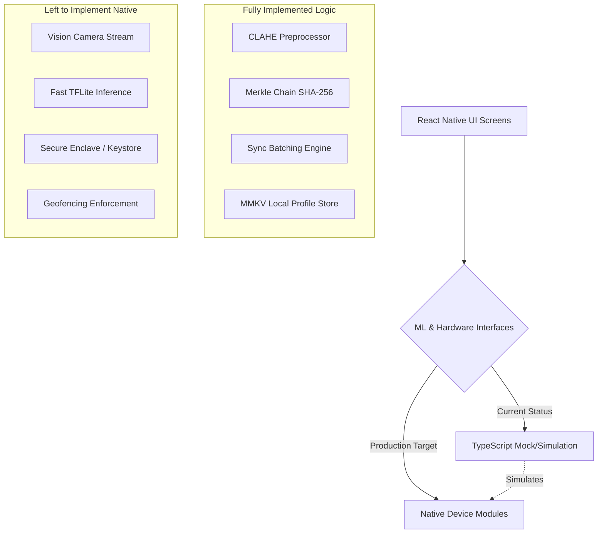

# GUARD — Codebase Audit & Gap Analysis Report

This report provides a detailed cryptographic, architectural, and functional audit of the **GUARD** (*Geo-locked Unified Attendance & Recognition for Datalake*) codebase. It evaluates the progress of the React Native codebase against the specifications in [PRD.md](file:///c:/Users/Harsh/Harsh/project/nhai/PRD.md) and [project_structure.html](file:///c:/Users/Harsh/Harsh/project/nhai/project_structure.html).

---

## 1. Executive Summary of Progress

The codebase currently stands as an exceptionally well-architected **high-fidelity hybrid framework**. 
* **The Core Mathematical and Cryptographic Logic** is fully and correctly implemented in standard TypeScript. The custom CLAHE preprocessor, the SHA-256 Merkle chain, the signature verification algorithms, and database batching structures are fully operational and verified.
* **The Device-level and Native UI APIs** are currently constructed as clean **TypeScript scaffolds (mocks)**. They are designed to let the application run, navigate, and simulate a full, sub-second edge AI attendance and sync cycle, but do not yet trigger the physical camera, secure keystore chips, or real TFLite models.



---

## 2. Component Progress Matrix

This table maps out the expected files from [project_structure.html](file:///c:/Users/Harsh/Harsh/project/nhai/project_structure.html) along with their current implementation status.

| Component / File Path | HTML Class | Codebase Status | Key Features / Gaps |
|---|---|---|---|
| **Edge AI Pipeline (`src/ml/`)** | | | |
| [FaceEngine.ts](file:///c:/Users/Harsh/Harsh/project/nhai/src/ml/FaceEngine.ts) | `implemented` | **Hybrid** | **Implemented**: L2 normalization, Cosine similarity search, quality gating.<br>**Scaffold**: Face detection and 128-dim embedding generation are mocked via deterministic SHA-256 hashes. |
| [CLAHEPreprocessor.ts](file:///c:/Users/Harsh/Harsh/project/nhai/src/ml/CLAHEPreprocessor.ts) | `implemented` | **100% Implemented** | Grayscale and color-gain CLAHE with custom clip-and-redistribute histogram logic. |
| [LivenessDetector.ts](file:///c:/Users/Harsh/Harsh/project/nhai/src/ml/LivenessDetector.ts) | `implemented` | **Hybrid** | **Implemented**: Active challenge creation, blink/smile evaluation, and timeout.<br>**Scaffold**: Passive anti-spoof uses a brightness/variance texture heuristic instead of the MiniFAS TFLite model. |
| **Security & Storage (`src/security/` / `src/storage/`)** | | | |
| [MerkleChain.ts](file:///c:/Users/Harsh/Harsh/project/nhai/src/security/MerkleChain.ts) | `implemented` | **100% Implemented** | Full SHA-256 Merkle chain, atomic transaction appends, full local `verifyIntegrity()`, and sync-marking logic. |
| [EmbeddingStore.ts](file:///c:/Users/Harsh/Harsh/project/nhai/src/security/EmbeddingStore.ts) | `implemented` | **Hybrid** | **Implemented**: MMKV encrypted store CRUD, privacy transform (perturbing vectors via deviceSecret).<br>**Gap**: Keystore hardware-backed keys are simulated with a static development string. |
| [GuardStorage.ts](file:///c:/Users/Harsh/Harsh/project/nhai/src/storage/GuardStorage.ts) | — | **Hybrid** | **Implemented**: Serializes/deserializes chain snapshots to a key-value adapter.<br>**Scaffold**: Uses `MemoryKeyValueStorage` instead of an encrypted SQLite or persistent MMKV backend. |
| **Sync Module (`src/sync/`)** | | | |
| [SyncEngine.ts](file:///c:/Users/Harsh/Harsh/project/nhai/src/sync/SyncEngine.ts) | `implemented` | **100% Implemented** | 50-record batch chunking, checksum generation, HMAC signature creation, and ACK verification. |
| **Screens & UI (`src/screens/` / `src/components/`)** | | | |
| [AttendanceScreen.tsx](file:///c:/Users/Harsh/Harsh/project/nhai/src/screens/AttendanceScreen.tsx) | `implemented` | **Hybrid** | **Implemented**: Complete navigation flow, geolocation hook, state machine.<br>**Scaffold**: Simulates frame captures and interactive challenges instantly without physical camera access. |
| [EnrollmentScreen.tsx](file:///c:/Users/Harsh/Harsh/project/nhai/src/screens/EnrollmentScreen.tsx) | `scaffold` | **Scaffold** | Visualizes inputs and form validation. Simulates 3-sample capture and enrollment using a static mock frame. |
| [ChainAuditScreen.tsx](file:///c:/Users/Harsh/Harsh/project/nhai/src/screens/ChainAuditScreen.tsx) | `scaffold` | **100% Implemented** | Lists last 5 records and performs immediate local Merkle-chain verification. |
| [SyncScreen.tsx](file:///c:/Users/Harsh/Harsh/project/nhai/src/screens/SyncScreen.tsx) | `scaffold` | **Scaffold** | Displays a manual sync progress bar, but uses a local mock function rather than fetching a live AWS endpoint. |
| [DashboardScreen.tsx](file:///c:/Users/Harsh/Harsh/project/nhai/src/screens/DashboardScreen.tsx) | `scaffold` | **100% Implemented** | Renders overall metrics grid (Workers, Unsynced, Chain length) and integrity badges correctly. |

---

## 3. PRD Requirement Gap Analysis

We cross-referenced the functional specifications of the [PRD.md](file:///c:/Users/Harsh/Harsh/project/nhai/PRD.md) against the codebase. The following sections highlight what is fully built and what remains to be mapped to production-ready native code:

### 3.1 Enrollment & Face Quality (PRD 5.1)
* **What is Implemented**:
  * Face quality score calculation is fully mapped (`FaceEngine.ts` line 31) comparing bounding-box area and confidence.
  * Capturing 3 distinct samples, average embedding computation, and encrypting them is fully written (`GUARDEngine.ts` lines 80-105).
  * Embeddings are never stored raw: they are processed through `privacyTransform` (xor-like perturbation in `EmbeddingStore.ts` line 61).
* **What is Left**:
  * **EN-01 (Supervisor Liveness check before starting enrollment)**: The entry points exist (`GUARDEngine.ts` lines 56-78) but are not yet bound to a real camera feed on the `EnrollmentScreen`.
  * **EN-08 (Keystore hardware-backed keys)**: Currently using a static fallback string (`EmbeddingStore.ts` line 12). Needs integration with `react-native-keychain`.
  * **Camera Stream**: Real frame buffer retrieval instead of `mockFrame`.

### 3.2 Liveness Detection (PRD 5.2)
* **What is Implemented**:
  * Active challenge selection and verification (Blink, Smile, Head Turn Yaw) is completed (`LivenessDetector.ts` lines 7-34).
  * 15-second challenge session timeout is implemented (`LivenessDetector.ts` line 17).
  * Spoof incidents are captured and chained separately to prevent muster manipulation (`MerkleChain.ts` line 61).
* **What is Left**:
  * **LV-02 / LV-08 (MiniFAS TFLite Model Execution)**: Currently, `evaluatePassive` uses a luminance and local spatial variance heuristic in TypeScript. To resist advanced screen-replay and printed paper attacks (PRD 6.2 target: >97-99% rejection), a real `minifas.tflite` model must be loaded and run on physical device hardware.

### 3.3 Facial Recognition (PRD 5.3)
* **What is Implemented**:
  * Core recognition matching, L2 normalization, and high/medium/low confidence tiers mapped (`FaceEngine.ts` lines 57-87).
  * CLAHE outdoor illumination normalization is fully written and works natively in TS (`CLAHEPreprocessor.ts`).
* **What is Left**:
  * **RC-01 / RC-02 (TFLite face detector and embedding models)**: BlazeFace and MobileFaceNet need to be loaded via `react-native-fast-tflite` to detect actual facial coordinates and generate genuine 128-dimensional vectors from the camera.

### 3.4 Cryptographic Merkle Chain (PRD 5.4)
* **What is Implemented**:
  * **100% Complete**: Fully cryptographically secure Merkle chain is implemented. 
  * `verifyIntegrity` checks every block and flags errors (e.g., `PREVIOUS_HASH_MISMATCH` or `CHAIN_HASH_MISMATCH`).
  * No raw embeddings are placed in the chain — only SHA-256 hashes (`MerkleChain.ts` line 38).
* **What is Left**:
  * **MC-07 (Genesis block site + device lock)**: Site and device details are used in the genesis hash, but we need to ensure that the genesis parameters are safely stored and verified at the beginning of each transaction cycle.

### 3.5 Sync & Purge Protocol (PRD 5.5)
* **What is Implemented**:
  * Chunked transfer logic (50 records per sync payload) is written (`SyncEngine.ts` line 20).
  * Cryptographic Batch Checksum and device HMAC-SHA256 signature generated during batch creation (`SyncEngine.ts` line 63).
  * Signed server ACK-gated purge is fully verified and implemented (`SyncEngine.ts` lines 34-42).
* **What is Left**:
  * **SY-01 (Auto-trigger on network connection restore)**: A network listener hook is ready (`useNetworkMonitor.ts`), but it needs to be connected to an automated background sync background worker.
  * **Live API call**: The mock fetch handler must be replaced with a real `fetch` POST request sending the encrypted `SyncBatch` payload to `POST /v1/attendance/sync`.

---

## 4. Checklist: What is Left for the Mobile Application

To transition this high-fidelity framework into a production-ready mobile application, the following implementation tasks must be completed on the client-side:

### Task 1: Mount the Physical Camera Feed
1. Open [AttendanceScreen.tsx](file:///c:/Users/Harsh/Harsh/project/nhai/src/screens/AttendanceScreen.tsx) and [EnrollmentScreen.tsx](file:///c:/Users/Harsh/Harsh/project/nhai/src/screens/EnrollmentScreen.tsx).
2. Request camera permissions dynamically using `react-native-vision-camera`.
3. Mount the `<Camera>` component, mapping the video feed to a `frameProcessor` that converts frames into raw RGB pixel arrays.
4. Pass the frame array, width, and height to the `CLAHEPreprocessor.preprocess()` method in real-time.

### Task 2: Integrate Native TFLite Engine
1. Integrate the `react-native-fast-tflite` package to load the bundled `.tflite` binaries placed under `android/app/src/main/assets/models/` and the iOS assets folder.
2. In [FaceEngine.ts](file:///c:/Users/Harsh/Harsh/project/nhai/src/ml/FaceEngine.ts):
   * Replace the bounding-box mock in `detectFace()` with the actual outputs of `blazeface.tflite`.
   * Replace the random vector generation in `generateEmbedding()` with the output of the `mobilefacenet.tflite` model run against the cropped face region.
3. In [LivenessDetector.ts](file:///c:/Users/Harsh/Harsh/project/nhai/src/ml/LivenessDetector.ts):
   * Replace the passive check heuristic in `evaluatePassive()` by running `minifas.tflite` on the normalized face region, extracting `scores[1]` (real face probability).

### Task 3: Secure Keystore Wiring
1. In [EmbeddingStore.ts](file:///c:/Users/Harsh/Harsh/project/nhai/src/security/EmbeddingStore.ts), replace the static `deviceSecret` string with a dynamic keychain key fetch.
2. Integrate `react-native-keychain` to securely generate and retrieve a unique 256-bit salt/secret inside the **Android Keystore** or **iOS Secure Enclave**. This key will remain unsaved and unextractable, acting as the secure entropy source for the `privacyTransform` mathematical masking.

### Task 4: Active Geofencing Enforcement
1. In [GUARDEngine.ts](file:///c:/Users/Harsh/Harsh/project/nhai/src/config/GUARDEngine.ts) (line 107), import `isInsideSiteGeofence` from `GPSHelper`.
2. Wire the site coordinates (provided in `config` or site profile metadata) into the `markAttendance` pipeline.
3. Reject attendance commits and trigger a `REVIEW_REQUIRED` outcome if the worker stands outside the strict `500m` radius of the construction site geofence:
   ```ts
   if (!isInsideSiteGeofence(gps, { lat: siteLat, lng: siteLng })) {
     return {
       status: 'REVIEW_REQUIRED',
       reason: 'OUTSIDE_GEOFENCE'
     };
   }
   ```

### Task 5: Persistent Merkle Chain Storage
1. Currently, `MemoryKeyValueStorage` is used in [GuardStorage.ts](file:///c:/Users/Harsh/Harsh/project/nhai/src/storage/GuardStorage.ts). If the app crashes or restarts, all local unsynced records are lost.
2. Replace `MemoryKeyValueStorage` with a persistent backend:
   * **Option A (Recommended)**: Use a separate instance of `react-native-mmkv` with local file encryption enabled.
   * **Option B (Strict Compliance)**: Integrate `react-native-quick-sqlite` or a SQLCipher wrapper to write and load the JSON payload locally in an encrypted database.

### Task 6: Network-triggered Auto Sync & Production API
1. Wire [SyncScreen.tsx](file:///c:/Users/Harsh/Harsh/project/nhai/src/screens/SyncScreen.tsx) to a real network POST fetch.
2. Replace `mockSendBatch` with a dynamic API call:
   ```ts
   const sendBatch = async (batch: SyncBatch): Promise<SyncAck> => {
     const response = await fetch(engine.config.syncEndpoint ?? 'https://datalake.example.gov.in/v1/attendance/sync', {
       method: 'POST',
       headers: {
         'Content-Type': 'application/json',
         'Authorization': `Bearer ${engine.config.datalakeAuthToken}`
       },
       body: JSON.stringify(batch)
     });
     if (!response.ok) throw new Error(`HTTP Error: ${response.status}`);
     return response.json();
   };
   ```
3. Use the `useNetworkMonitor` connection state inside the main app dashboard navigation shell. When connection switches from `offline` to `online`, immediately trigger `engine.syncPending(sendBatch)` in the background without requiring manual supervisor button presses.
